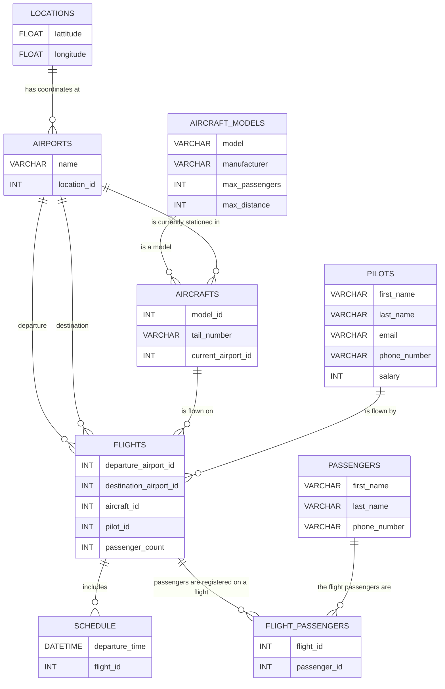

```mermaid
erDiagram
    
    SCHEDULE {
        DATETIME departure_time
        INT flight_id
    }

    FLIGHTS {
        INT departure_airport_id
        INT destination_airport_id
        INT aircraft_id
        INT pilot_id
        INT passenger_count
    }

    PASSENGERS {
        VARCHAR first_name
        VARCHAR last_name
        VARCHAR phone_number
    }

    FLIGHT_PASSENGERS {
        INT flight_id
        INT passenger_id
    }

    AIRCRAFTS {
        INT model_id
        VARCHAR tail_number
        INT current_airport_id
    }

    AIRCRAFT_MODELS {
        VARCHAR model
        VARCHAR manufacturer
        INT max_passengers
        INT max_distance
    }

    PILOTS {
        VARCHAR first_name
        VARCHAR last_name
        VARCHAR email
        VARCHAR phone_number
        INT salary
    }

    AIRPORTS {
        VARCHAR name
        INT location_id
    }

    LOCATIONS {
        FLOAT lattitude
        FLOAT longitude
    }

    FLIGHTS ||--o{ SCHEDULE: "includes"
    AIRPORTS ||--o{ FLIGHTS: "departure"
    AIRPORTS ||--o{ FLIGHTS: "destination"
    AIRCRAFTS ||--o{ FLIGHTS: "is flown on"
    PILOTS ||--o{ FLIGHTS: "is flown by"
    FLIGHTS ||--o{ FLIGHT_PASSENGERS: "passengers are registered on a flight"
    PASSENGERS ||--o{ FLIGHT_PASSENGERS: "the flight passengers are"
    AIRCRAFT_MODELS ||--o{ AIRCRAFTS: "is a model"
    AIRPORTS ||--o{ AIRCRAFTS: "is currently stationed in"
    LOCATIONS ||--o{ AIRPORTS: "has coordinates at"
```